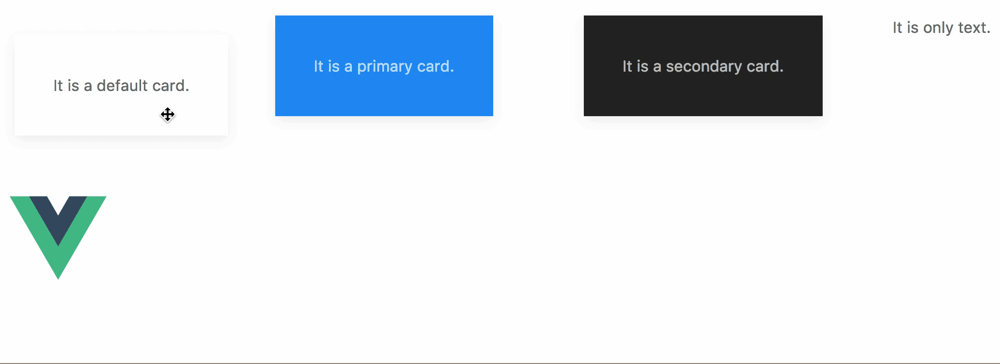

# uk-dnd
It is a uikit drag and drop component for vue.



## Installation

```
$ npm install --save uk-dnd
```

## Usage

To enable drag and drop, only need to use the uk-dnd element as your node (e.g: span, img, div, etc.) wrapper, for example:

```
<!--
options: {
    x (option): Number, [default: 0]
    y (option): Number, [default: 0]
    w (option): String or Number, [e.g: "200" or "200px" or "100%"] [default: "auto"]
    h (option): String or Number  [e.g: "100" or "100px" or "50%"] [default: "auto"]
}
-->
<div id="app">
    <uk-dnd>
        <span>It is draggable text!</span>
    </uk-dnd>
</div>
```

```
import Vue from "vue";
import UkDnd from "uk-dnd";

Vue.component("uk-dnd", UkDnd);
new Vue({
    el: "#app"
});
```

## Local test

1. Clone repository.

    ```
    $ git clone git@github.com:vue-kit/uk-dnd.git
    ```

2. Install dependencies.

    ```
    $ npm install
    ```

3. Run test page with hot reload at localhost:8080.

    ```
    $ npm test
    ```
